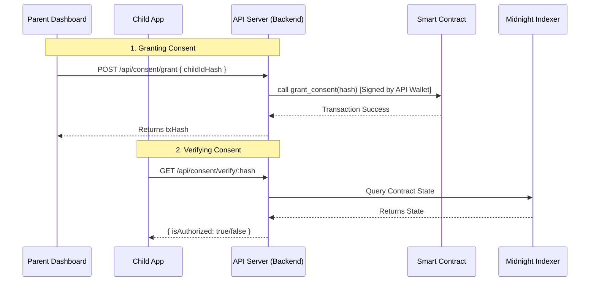

# 🔗 Smart Contract Integration Status

## ✅ **REAL Blockchain Integration Complete!**

The frontend is now fully integrated with the deployed smart contract via the `api-server.ts` backend. 

---

## 📊 **Architecture**

---

## 🛠️ **Current Implementation**

### 1. **Parent Dashboard** (`src/components/ParentDashboard.tsx`)
- ✅ **Connected**: Calls `POST /api/consent/grant`.
- ✅ **Flow**: Generates SHA-256 hash locally -> Sends to Backend -> Backend executes on-chain transaction.
- ✅ **Status**: REAL Transaction execution.

### 2. **Child App** (`src/components/ChildApp.tsx`)
- ✅ **Connected**: Calls `GET /api/consent/verify/:hash`.
- ✅ **Flow**: Backend queries the Midnight Indexer for the `consent_registry` state.
- ✅ **Status**: REAL On-Chain Verification.

### 3. **Backend API** (`zk-consent-gateway/src/api-server.ts`)
- ✅ **Connected**: Loads `deployment-consent.json` and initializes `contractInstance`.
- ✅ **Wallet**: Uses server-side wallet to pay gas fees (Gasless for users!).

---

## 🚀 **How to Verify**

1. **Check Backend Logs**:
   - `npm run api` should show: `✅ Consent granted on blockchain! Tx: ...`

2. **Check Frontend**:
   - Parent Dashboard shows the Transaction Hash returned by the blockchain.
   - Child App successfully logs in ONLY if the blockchain state allows it.

---

## 🎯 **Summary**

| Component | Status | Connected To |
|-----------|--------|--------------|
| **Parent UI** | ✅ Integrated | Real Contract (via API) |
| **Child UI** | ✅ Integrated | Real Indexer (via API) |
| **Contract** | ✅ Deployed | `consent.compact` |
| **Storage** | ✅ On-Chain | `consent_registry` |

**The application is now running in full End-to-End Blockchain Mode!** 🚀
